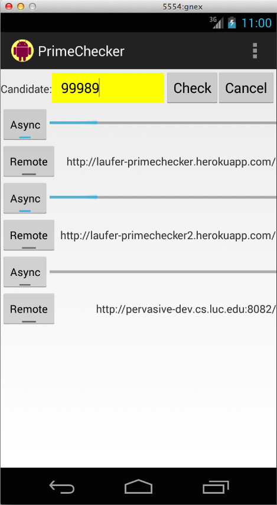

Keeping the User Interface Responsive with Background Activities
================================================================

Learning objectives
-------------------

- synchronous local foreground tasks in Android (running directly in
  an event listener) -> bad unless really short
- asynchronous local background tasks in Android using AsyncTask ->
  good but need to handle
  - progress reporting
  - cancelation

Introduction
------------

The running example for this section is a simple prime number checking
app.

   Screenshot of an Android app for checking prime numbers

This app allows us to enter a number in a text field. When we press
the "check" button, the app checks whether the number we entered is
prime. There are different ways to run this check, and the app allows
us to explore these.

To check whether a number is prime, we can use this brute-force
algorithm. While not a good prime checker implementation, the fact
that it hogs the processor makes it an effective running example for
discussing whether to move processor-bound activities to the
background (or remote servers).

.. todo:: footnote with forward reference to future work on web
	  services/remote tasks

.. literalinclude:: ../examples/primenumbers-android-java/PrimeNumbers/src/main/java/edu/luc/etl/cs313/android/primechecker/android/PrimeCheckerTask.java
   :start-after: begin-method-isPrime
   :end-before: end-method-isPrime
   :language: java 
   :linenos:

For now, let's ignore the ``isCancelled`` and ``updateProgress``
methods and agree to discuss their significance later in this section.

The problem with foreground tasks
---------------------------------

As a first attempt, we now can run the ``isPrime`` method from within
our event listener in the current thread of execution (the main GUI
thread).

.. literalinclude:: ../examples/primenumbers-android-java/PrimeNumbers/src/main/java/edu/luc/etl/cs313/android/primechecker/android/PrimeCheckerAdapter.java
   :start-after: begin-fragment-executeForeground
   :end-before: end-fragment-executeForeground
   :language: java 
   :linenos:

The methods ``onPreExecute`` and ``onPostExecute`` are for resetting
the user interface and displaying the result.

This approach works for very small numbers. For larger numbers,
however, the user interface freezes noticeably while the prime number
check is going on, so it does not respond to pressing the cancel
button. There is no progress reporting either: The progress bar jumps
from zero to 100 when the check finishes.

.. todo:: explain freezing UI, cannot cancel

.. todo:: explain that even attempted UI *updates* are queued and don't happen until foreground task is done
        - this is a consequence of the single-threaded event model
        - why not make event handling asynchronous? huge can of worms,
	  UI is shared resource, would have to use mutual exclusion in
	  every event handler that accesses GUI; explain a bit more in
	  a sidebar (including race conditions etc.)

.. todo:: consider Q&A-style sidebar on single-threaded GUI model (with brief intro to race conditions, explain how component repaint events are queued, etc.)

Background tasks to the rescue
------------------------------

- explain concept, want these:
  - async background task with interface
  - progress reporting 
  - cancelation
- describe Android AsyncTask and how it supports the concept
- example: PrimeCheckerTask

.. code-block:: xml
   :linenos:

   public abstract class AsyncTask<Params, Progress, Result> {
       
   }

The three types used by an asynchronous task are the following:

- Params, the type of the parameters sent to the task upon execution.
- Progress, the type of the progress units published during the background computation.
- Result, the type of the result of the background computation.

Not all types are always used by an asynchronous task. To mark a type
as unused, simply use the type Void.

When an asynchronous task is executed, the task goes through 4 steps:

- onPreExecute(), invoked on the UI thread before the task is executed. This step is normally used to setup the task, for instance by showing a progress bar in the user interface.
- doInBackground(Params...), invoked on the background thread immediately after onPreExecute() finishes executing. This step is used to perform background computation that can take a long time. The parameters of the asynchronous task are passed to this step. The result of the computation must be returned by this step and will be passed back to the last step. This step can also use publishProgress(Progress...) to publish one or more units of progress. These values are published on the UI thread, in the onProgressUpdate(Progress...) step.
- onProgressUpdate(Progress...), invoked on the UI thread after a call to publishProgress(Progress...). The timing of the execution is undefined. This method is used to display any form of progress in the user interface while the background computation is still executing. For instance, it can be used to animate a progress bar or show logs in a text field.
- onPostExecute(Result), invoked on the UI thread after the background computation finishes. The result of the background computation is passed to this step as a parameter.

The solution is to run the ``isPrime`` method the background by
scheduling the corresponding ``AsyncTask`` on a suitable executor
object.

.. literalinclude:: ../examples/primenumbers-android-java/PrimeNumbers/src/main/java/edu/luc/etl/cs313/android/primechecker/android/PrimeCheckerAdapter.java
   :start-after: begin-fragment-executeBackground
   :end-before: end-fragment-executeBackground
   :language: java 
   :linenos:

We set up the corresponding asynchronous task with an input of type
``Long``, progress of type ``Integer``, and result of type
``Boolean``. In addition, the task has access to the input text field
and progress bar in the Android GUI.

.. literalinclude:: ../examples/primenumbers-android-java/PrimeNumbers/src/main/java/edu/luc/etl/cs313/android/primechecker/android/PrimeCheckerTask.java 
   :start-after: begin-fragment-PrimeCheckerTaskSETUP 
   :end-before: end-fragment-PrimeCheckerTaskSETUP 
   :language: java 
   :linenos:

Most importantly, the main method of the task, ``doInBackground``,
invokes ``isPrime``. The auxiliary methods ``isCancelled`` and
``publishProgress`` we saw earlier in the implementation of
``isPrime`` are for checking for requests to cancel the current task
and updating the progress bar, respectively.

In our example, when the user presses the cancel button, any currently
running tasks are canceled using the control method
``cancel(boolean)``, and subsequent invocations of ``isCancelled``
return false. Conversely, when ``publishProgress`` is invoked from
within ``doInBackground`` (in our case, from within ``isPrime``), an
invocation of the lifecycle method ``onProgressUpdate(Progress...)``
with the provided argument(s) is scheduled on the main event handling
thread and will be executed as soon as that thread gets to it.

The various lifecycle methods are implemented here:

.. literalinclude:: ../examples/primenumbers-android-java/PrimeNumbers/src/main/java/edu/luc/etl/cs313/android/primechecker/android/PrimeCheckerTask.java
   :start-after: begin-methods-asyncTask
   :end-before: end-methods-asyncTask
   :language: java 
   :linenos:

.. todo:: end of section summaries, Q&A/FAQ, questions to ponder/exercises
