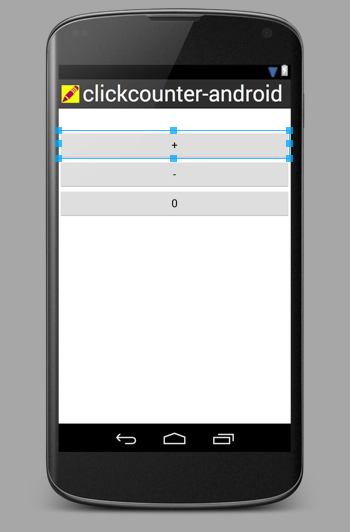
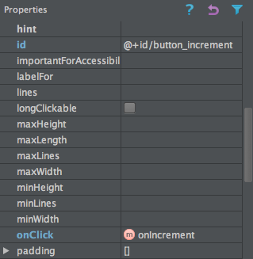
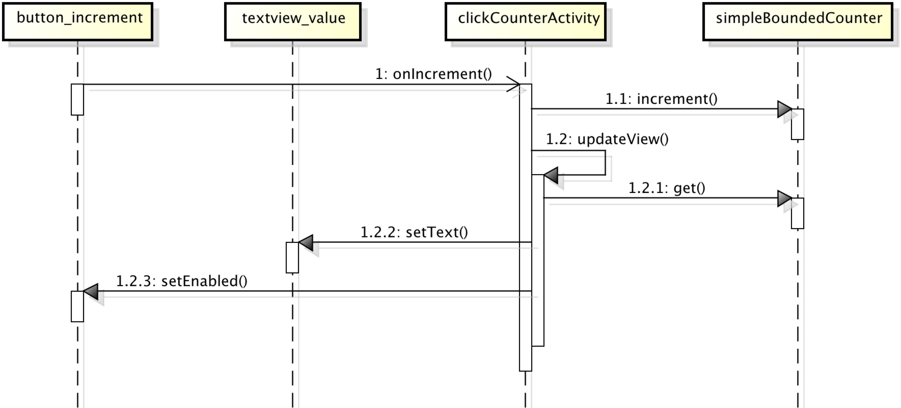

Basic Event-Based User Interaction
==================================

Learning objectives
-------------------

* Introduction to the Android framework (CS2: K, IOOD: C)
* User interaction in console applications (CS1: A)
* User interaction in applications with a graphical interface (GUI) (CS2: A)
* Modeling simple behaviors with UML State Machine diagrams (IOOD: C) 
* Understanding user interaction as events

   * GUI widgets as event sources (CS2: C)

   * Event listeners and the Observer pattern (IOOD: A)

   * Single-threaded UI event handling

* The Model-View-Adapter architectural pattern (IOOD: A)
* Testing interactive applications (IOOD: A)
* Testing

  - Different types of testing

    - Component-level unit testing
    - System testing
    - Instrumentation testing

  - Testcase Superclass pattern

Introduction
------------

In this section, we'll start with a simple interactive behavior and
explore how to implement this using the Android mobile application
development framework. Our running example will be a bounded click
counter application that can be used to keep track of the capacity of,
say, a movie theater.

The bounded counter abstraction
-------------------------------

A *bounded counter* [REF], the concept underlying this application, is an
integer counter that is guaranteed to stay between a preconfigured
minimum and maximum value. This is called the *data invariant* of the
bounded counter.

.. math::

   min \leq counter \leq max

We can represent this abstraction as a simple, passive object with,
say, the following interface:

.. literalinclude:: ../examples/clickcounter-android-java/ClickCounter/src/main/java/edu/luc/etl/cs313/misc/boundedcounter/cli/BoundedCounter.java
   :start-after: begin-interface-BoundedCounter
   :end-before: end-interface-BoundedCounter
   :language: java 
   :linenos:

In following a test-driven mindset [REF], we would test implementations of
this interface using methods such as this one, which ensures that
incrementing the counter works properly:

.. literalinclude:: ../examples/clickcounter-android-java/ClickCounter/src/main/java/edu/luc/etl/cs313/misc/boundedcounter/model/AbstractCounterTest.java
   :start-after: begin-method-testIncrement
   :end-before: end-method-testIncrement
   :language: java 
   :linenos:

In the remainder of this section, we'll put this abstraction to good
use by building an interactive application on top of it.

The interactive behavior of a click counter device
--------------------------------------------------

Next, let's imagine a device that realizes this bounded counter
concept. For example, a bouncer positioned at the door of a movie
theater to prevent overcrowding, could benefit from such a device with
the following behavior:

- The device is preconfigured to the capacity of the venue.

- The device always displays the current counter value, initially
  zero.

- Whenever a person enters the movie theater, the bouncer presses the
  *increment* button; if there is still capacity, the counter value
  goes up by one.

- Whenever a person leaves the theater, the bouncer presses the
  *decrement* button; the counter value goes down by one (but not
  below zero).

- If the maximum has been reached, the *increment* button either
  becomes unavailable (or, as an alternative design choice, attempts
  to press it cause an error). This behavior continues until the
  counter value falls below the maximum again.

- There is a *reset* button for resetting the counter value directly
  to zero.

A simple graphical user interface (GUI) for a click counter
-----------------------------------------------------------

Let's now flesh out the user interface of this click counter
device. In the case of a dedicated hardware device, the interface
could have tactile inputs and visual outputs, along with, say, audio
and haptic outputs.

As a minimum, we would require these interface elements:

- Three buttons, for incrementing and decrementing the counter value
  and for resetting it to zero.

- A numeric display of the current counter value.

Optionally, we would benefit from different types of feedback:

- Beep and/or vibrate when reaching the maximum counter value.

- Show the percentage of capacity as a numeric percentage or color
  thermometer.

Instead of a hardware device, we'll now implement this behavior as a
mobile software app, so let's focus first on the minimum interface
elements. In addition, we'll make the design choice that operations
that would violate the counter's data invariant are disabled.

These decisions lead to the three *view states* shown in the following
images. Note how the reset button is always enabled, while the
decrement and increment buttons are disabled in the minimum and
maximum states, respectively.

.. figure:: images/BoundedCounterViewStateMin.png
   :alt: Bounded Counter Min State
   :scale: 50%

   The initial (minimum) view state of the bounded click counter
   Android [REF] app with the decrement button disabled.

.. figure:: images/BoundedCounterViewStateCounting.png 
   :alt: Bounded Counter Counting State
   :scale: 50%

   The counting view state of the bounded click counter Android app
   with all buttons enabled.

.. figure:: images/BoundedCounterViewStateMax.png 
   :alt: Bounded Counter Max State
   :scale: 50%

   The maximum view state of the bounded click counter Android app
   with the increment button disabled (assuming a maximum value of
   10).

Understanding user interaction as events
----------------------------------------

It was fairly easy to express the familiar bounded counter abstraction
and to envision a possible user interface for putting this abstraction
to practical use. The remaining challenge is to tie the two together
in a meaningful way, such that the interface uses the abstraction to
provide the required behavior. In this section, we'll work on bridging
this gap.

Modeling the interactive behavior
^^^^^^^^^^^^^^^^^^^^^^^^^^^^^^^^^

As a first step, let's abstract away the concrete aspects of the user
interface: 

- Instead of touch buttons, we'll have *input events*.

- Instead of setting a visual display, we'll *modify a counter value*.

After we take this step, we can use a UML state machine diagram [REF]
to model the dynamic behavior we described at the beginning of this
section more formally. Note how the touch buttons correspond to
*events* (triggers of *transitions*, i.e., arrows) with the matching
names.

The behavior starts with the *initial pseudostate* represented by the
black circle. From there, the counter value gets its initial value,
and we start in the minimum state. Assuming that the minimum and
maximum values are at least two apart, we can increment
unconditionally and reach the counting state. As we keep incrementing,
we stay here as long as we are at least two away from the maximum
state. As soon as we are exactly one away from the maximum state, the
next increment takes us to that state, and now we can no longer
increment, just decrement. The system mirrors this behavior in
response to the decrement event. There is a surrounding global state
to support a single reset transition back to the minimum state.

.. figure:: images/BoundedCounterStates.png
   :alt: Bounded Counter FSM

   The UML state machine diagram modeling the dynamic behavior of the
   bounded counter application.

As you can see, the three model states map directly to the view states
from the previous subsection, and the transitions enabled in each
model state map to the buttons enabled in each view state. This is not
always the case, though, and we will see examples in a later section
of an application with multiple model states but only a single view
state.

GUI widgets as event sources
^^^^^^^^^^^^^^^^^^^^^^^^^^^^

The two figures show the GUI increment button selected in the Android
Studio view component editor and the corresponding hierarchical tree
view, respectively. 

Our next step is to bring the app to life by connecting the visual
interface with the interactive behavior. For example, when pressing
the increment button in a non-full counter state, we expect the
displayed value to go up by one. In general, the user can trigger
certain events by interacting with view components and other event
sources. For example, one can press a button, swiping one's finger
across the screen, rotate the device, etc.

   The visual interface of the application in the Android Studio view  
   component editor with the increment button selected.  

.. figure:: images/ComponentTree.png
   :alt: Click Counter View Component Tree
   :scale: 50%

   The view component tree of the bounded click counter Android app.

Event listeners and the Observer pattern
^^^^^^^^^^^^^^^^^^^^^^^^^^^^^^^^^^^^^^^^^^^^^^^^^^

We now discuss what an event is and what happens after it gets
triggered. We will continue focusing on our running example of
pressing the increment button.

This figure shows the selected increment button in the view component
property editor. Most importantly, the ``onClick`` event, which occurs
when the user presses this button, maps to invocations of the
``onIncrement`` method in the associated activity instance.

   The increment button in the Android Studio view component editor.
 
The visual representation of an Android GUI is generated from an XML
source. For example, the source element for our increment button looks
like this. It textually maps the ``onClick`` attribute to the
``onIncrement`` method in the associated activity instance. 

.. code-block:: xml
   :linenos:
   :emphasize-lines: 5

    <Button
        android:id="@+id/button_increment"
        android:layout_width="fill_parent"
        android:layout_height="wrap_content"
        android:onClick="onIncrement"
        android:text="@string/label_increment" />

The association with an instance of a particular activity class is
declared separately in the app's *Android manifest*. The top-level
``manifest`` element specifies the Java package of the activity class,
and the ``activity`` element on line 5 specifies the name of the
activity class, ``ClickCounterActivity``.

.. code-block:: xml
   :linenos:
   :emphasize-lines: 5

   <manifest xmlns:android="http://schemas.android.com/apk/res/android"
       package="edu.luc.etl.cs313.android.clickcounter" ...>
       ...
       <application ...>
           <activity android:name=".ClickCounterActivity" ...>
               <intent-filter>
                   <action android:name="android.intent.action.MAIN" />
                   <category android:name="android.intent.category.LAUNCHER" />
               </intent-filter>
           </activity>
       </application>
   </manifest>

So an *event* is just an invocation of an *event listener* method,
possibly with an argument describing the event. We first need to
establish the association between an event source and one (or possibly
several) event listener(s) by *subscribing* the listener to the
source. Once we do that, every time this source emits an event,
normally triggered by the user, the appropriate event listener method
gets called on each subscribed listener.

Unlike ordinary method invocations, where the caller knows the
identity of the callee, the (observable) event source provides a
general mechanism for subscribing a listener to a source. This
technique is widely known as the *Observer* design pattern.
 
Many GUI frameworks follow this approach. In Android, for example, the
general component superclass is ``View``, and there are various types
of listener interfaces, including ``OnClickListener``. In following
the *Dependency Inversion Principle (DIP)* [REF], the ``View`` class
owns the interfaces its listeners must implement.

.. code-block:: java
   :linenos:

   public class View {
       ...
       public static interface OnClickListener {
           public void onClick(View source);
       }
       public void setOnClickListener(final OnClickListener listener) { ... }
       ...
   }

Processing events triggered by the user
^^^^^^^^^^^^^^^^^^^^^^^^^^^^^^^^^^^^^^^

The Android activity is responsible for mediating between the view
components and the POJO bounded counter model we saw above. The full
cycle of each event-based interaction goes like this. By pressing the
increment button, the user triggers the ``onClick`` event on that
button, and the ``onIncrement`` method gets called. This method
interacts with the model instance by invoking the ``increment`` method
and then requests a view update of the activity itself. The
corresponding ``updateView`` method also interacts with the model
instance by retrieving the current counter value using the ``get``
method, displays this value in the corresponding GUI element with
unique ID ``textview_value``, and finally updates the view states as
necessary.

.. literalinclude:: ../examples/clickcounter-android-java/ClickCounter/src/main/java/edu/luc/etl/cs313/android/clickcounter/ClickCounterActivity.java
   :start-after: begin-method-onIncrement
   :end-before: end-method-onIncrement
   :language: java 
   :linenos:

.. literalinclude:: ../examples/clickcounter-android-java/ClickCounter/src/main/java/edu/luc/etl/cs313/android/clickcounter/ClickCounterActivity.java
   :start-after: begin-method-updateView
   :end-before: end-method-updateView
   :language: java 
   :linenos:

   This UML sequence diagram shows the full event-based interaction
   cycle in response to a press of the increment button. Stick arrow
   heads represent events, while solid arrow heads represent method
   invocations.

*What happens if the user presses two buttons at the same time?* The
GUI framework responds to at most one button press or other event
trigger at any given time. While the GUI framework is processing an
event, it places additional incoming event triggers on a queue and
fully processes each one in turn. Specifically, only after the event
listener method handling the current event returns will the framework
process the next event. (Accordingly, activation boxes of different
event listener method invocations in the UML sequence diagram must not
overlap.) This approach is called *single-threaded event handling*. It
keeps the programming model simple and avoids problems such as race
conditions or deadlocks that can arise in multithreaded approaches.

Application architecture  
------------------------
 
This overall application architecture, where a component mediates
between view components and model components, is known as
*model-view-adapter (MVA)*, where the adapter component mediates all
interactions between the view and the model. (By contrast, the
*model-view-controller (MVC)* architecture has a triangular shape and
allows the model to update the view(s) directly via update events.)
The figure below illustrates this architecture. The solid arrows
represent ordinary method invocations, and the dashed arrow represents
event-based interaction. View and adapter play the roles of observable
and observer, respectively, in the Observer pattern that describes the
top half of this architecture.

.. figure:: images/ModelViewAdapter.png
   :alt: Model-View-Adapter Architecture
   :scale: 100%

   This UML class diagram shows the Model-View-Adapter (MVA)
   architecture of the bounded click counter Android app. Solid arrows
   represent method invocation, and dashed arrows represent event
   flow.

Testing GUI applications
------------------------

Testing of GUI applications is a broad and important topic that goes
beyond the scope of this chapter. Here, we complete our running
example by focus on a few key techniques.

At the beginning of this section, we already saw an example of a
simple test method for the POJO bounded counter model. Because Android
view components support triggering events programmatically, we can
write system-level test methods that mimic the way a human user would
interact with the application.

The following test handles a simple scenario of pressing the reset
button, verifying that we are in the minimum view state, then pressing
the increment button, verifying that the value has gone up and we are
in the counting state, pressing the reset button again, and finally
verifying that we are back in the minimum state.

.. literalinclude:: ../examples/clickcounter-android-java/ClickCounter/src/main/java/edu/luc/etl/cs313/android/clickcounter/AbstractClickCounterActivityTest.java 
   :start-after: begin-method-testActivityScenarioIncReset
   :end-before: end-method-testActivityScenarioIncReset
   :language: java 
   :linenos:

The next test ensures that the visible application state is preserved
under device rotation. This is an important and effective test because
an Android application undergoes its entire lifecycle under rotation.

.. literalinclude:: ../examples/clickcounter-android-java/ClickCounter/src/main/java/edu/luc/etl/cs313/android/clickcounter/AbstractClickCounterActivityTest.java 
   :start-after: begin-method-testActivityScenarioRotation
   :end-before: end-method-testActivityScenarioRotation
   :language: java 
   :linenos:

Having a modular architecture, such as model-view-adapter, enables us
to test some of the application components in isolation. Our simple
unit tests for the POJO bounded counter model still work in the
context of the overall Android app.

The test code itself can benefit from the use of certain design
patterns. For example, we have two choice for system-testing our app:

- In-container/instrumentation testing on an actual Android phone or
  tablet emulator (or physical device) requires deploying the
  application under test and the test code to the emulator and tends
  to be quite slow.

- Out-of-container testing on the development workstation using a test
  framework such as *Robolectric* that simulates an Android runtime
  environment tends to be considerably faster.

Typically, we will want to run the exact same test logic in both
cases, starting with the simulated environment and occasionally
targeting the emulator or device. An effective way to structure our
test code for this purpose is the xUnit pattern *Testcase
Superclass*. As the pattern name suggests, we pull up the common test
code into an abstract superclass, and each of the two concrete test
classes inherits the common code and runs it in the desired
environment.

.. code-block:: java
   :linenos:

   @RunWith(RobolectricTestRunner.class)
   public class ClickCounterActivityRobolectric extends AbstractClickCounterActivityTest {
       // some minimal Robolectric-specific code
   }

The official Android test support, however, requires inheriting from a
specific superclass called ``ActivityInstrumentationTestCase2``. This
class now takes up the only superclass slot, so we cannot use the
Testcase Superclass pattern literally. Instead, we need to approximate
inheriting from our ``AbstractClickCounterActivityTest`` using
delegation to a subobject. This gets the job done but can get quite
tedious when a lot of test methods are involved.

.. code-block:: java
   :linenos:

   public class ClickCounterActivityTest 
     extends ActivityInstrumentationTestCase2<ClickCounterActivity> {
       ...
       // test subclass instance to delegate to
       private AbstractClickCounterActivityTest actualTest;

       @UiThreadTest
       public void testActivityScenarioIncReset() {
	   actualTest.testActivityScenarioIncReset();
       }
       ...
   }

References: 

- https://www.palantir.com/2009/04/model-view-adapter/
- https://bitbucket.org/loyolachicagocs_comp313/clickcounter-android-java 
- http://xunitpatterns.com/
- UML

