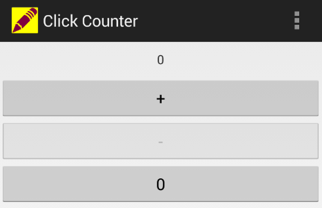
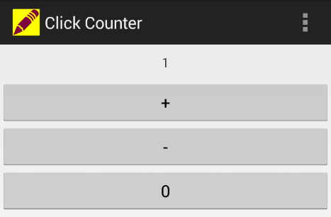
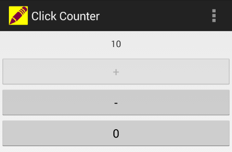
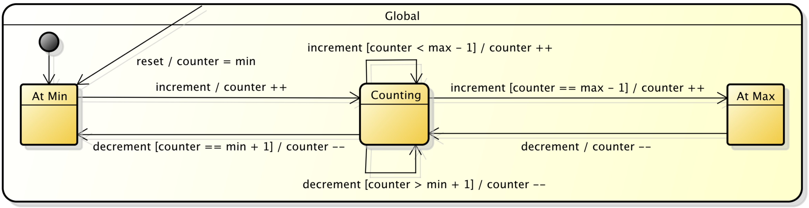
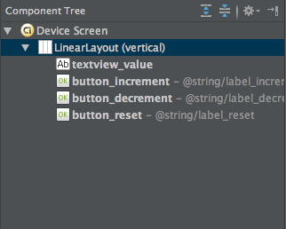
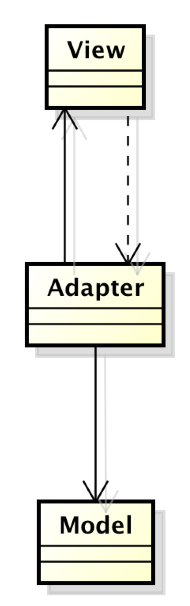

Basic Event-Based User Interaction
==================================

User interaction in console applications
-------------------------------------------------

asdf

User interaction in applications with a graphical user interface (GUI)
----------------------------------------------------------------------

   The initial (minimum) view state of the bounded click counter Android app.

   The counting view state of the bounded click counter Android app.

   The maximum view state of the bounded click counter Android app.

asdf

Understanding user interaction as events
----------------------------------------

   The finite state machine of the bounded counter model.

asdf

GUI widgets as event sources
^^^^^^^^^^^^^^^^^^^^^^^^^^^^

   The view component tree of the bounded click counter Android app.
 

asdf

Event listeners and the Observer pattern
^^^^^^^^^^^^^^^^^^^^^^^^^^^^^^^^^^^^^^^^^^^^^^^^^^

asdf

   The Model-View-Adapter (MVA) architecture of the bounded click
   counter Android app.

asdf
