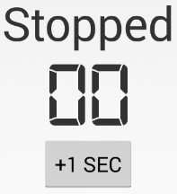
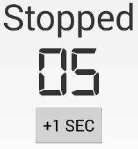
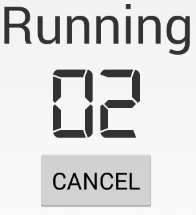
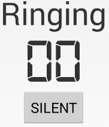
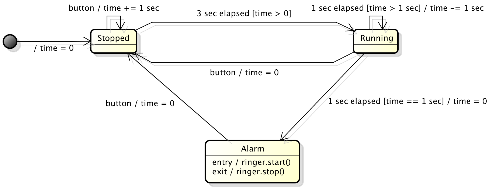
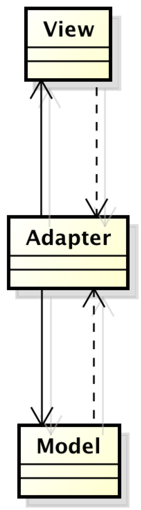

Interactive Behaviors and Implicit Concurrency with Internal Timers
===================================================================

Learning objectives
-------------------

**TODO** streamline

- Modeling
  - Distinguishing between view states and (behavioral) model states
- Semantics
  - Internal events from background timers
  - Concurrency issues: single-thread rule of accessing/updating the view in the GUI thread
- Architecture and Design (focus on relevant essentials here)
  - Distinguishing among dumb, reactive, and autonomous model components
  - Implementing state-dependent behavior using the State pattern
  - Command pattern for representing tasks as objects
  - Façade pattern for hiding complexity in the model from the adapter
  - Relevant class-level design principles
    - Dependency Inversion Principle (DIP)
    - Single Responsibility Principle (SRP)
    - Interface Segregation Principle (ISP)
  - Package-level architecture and relevant principles
    - Dependency graph (see also here)
    - Stable Dependencies Principle (SDP)
    - Acyclic Dependencies Principle (ADP)
  - Architectural journey
- Testing
  - Different types of testing
    - Component-level unit testing
    - System testing
    - Instrumentation testing
    - Mock-based testing
    - Testcase Superclass pattern
    - Test coverage

Introduction
------------

In this section, we'll study an application that has richer,
timer-based behaviors compared to the click counter example from the
previous section. Our example will be a countdown timer for cooking
and similar scenarios where we want to be notified when a set amount
of time has elapsed.

The interactive behavior of a countdown timer
---------------------------------------------

Let's start with a fairly abstract description of the countdown
timer's controls and behavior.

The timer exposes the following controls:

- One two-digit display of the form 88.
- One multi-function button.

The timer behaves as follows:

- The timer always displays the remaining time in seconds.
- Initially, the timer is stopped and the (remaining) time is zero.
- If the button is pressed when the timer is stopped, the time is
  incremented by one up to a preset maximum of 99. (The button acts as
  an increment button.)
- If the time is greater than zero and three seconds elapse from the
  most recent time the button was pressed, then the timer beeps once
  and starts running.
- While running, the timer subtracts one from the time for every
  second that elapses.
- If the timer is running and the button is pressed, the timer stops
  and the time is reset to zero. (The button acts as a cancel button.)
- If the timer is running and the time reaches zero by itself (without
  the button being pressed), then the timer stops counting down, and
  the alarm starts beeping continually and indefinitely.
- If the alarm is sounding and the button is pressed, the alarm stops
  sounding; the timer is now stopped and the (remaining) time is
  zero. (The button acts as a stop button.)

A graphical user interface (GUI) for a countdown timer
------------------------------------------------------

Our next step is to flesh out the GUI for our timer. For usability,
we'll label the multifunction button with its current function. We'll
also indicate which state the timer is currently in. 

The following screenshots show the default scenario where we start up
the timer, add a few seconds, wait for it to start counting down, and
ultimately reach the alarm state.

   The countdown timer in the initial stopped state with zero time.

   The countdown timer in the stopped state after adding some time.

   The countdown timer in the running state.

   The countdown timer in the alarm ringing state.

Modeling the interactive behavior
---------------------------------

   The UML state machine diagram modeling the dynamic behavior of the
   countdown timer application.
 
Let's again try to describe the abstract behavior of the countdown
timer using a UML state machine diagram. As usual, there are various
ways to do this, and our guiding principle is to keep things simple
and close to the informal description of the behavior.

It is easy to see that we need to represent the current counter
value. Once we accept this, we really don't need to distinguish
between the stopped state (with counter value zero) and the counting
state (with counter value greater than zero). The other states that
arise naturally are the running state and the alarm state. 

As in the click counter example, these model states map directly to
the view states shown above. Again, the differences among the view
states are very minor and are aimed mostly at usability: A properly
labeled button is a much more effective affordance than an unlabeled
or generically labeled one.

Note that there are two types of (internal) timers at work here:

- *one-shot timers*, such as the three-second timer in the stopped
  state that gets restarted every time we press the multifunction
  button to add time
- *recurring timers*, such as the one-second timer in the running
  state that fires continually for every second that goes by
 

Implementing time-based autonomous behavior
-------------------------------------------

While the entirely passive bounded counter behavior from the previous
section was straightforward to implement, the countdown timer includes
autonomous timer-based behaviors that give rise to another level of
complexity. 

There are different ways to deal with this behavioral
complexity. Given that we have already expressed the behavior as a
state machine, we can use the *State* software design pattern to
separate state-dependent behavior from overarching handling of
external and internal triggers and actions.

We start by defining a state abstraction. Each state has a unique
identifier and a state-specific method for updating the view.

.. literalinclude:: ../examples/countdowntimer-android-java/Timer/src/main/java/edu/luc/etl/cs313/android/countdowntimer/model/state/TimerState.java
   :start-after: begin-type-TimerState
   :end-before: end-type-TimerState
   :language: java 
   :linenos:

In addition, a state receives UI events and clock ticks. Accordingly,
it implements the corresponding interfaces, which are defined as
follows:

.. literalinclude:: ../examples/countdowntimer-android-java/Timer/src/main/java/edu/luc/etl/cs313/android/countdowntimer/common/TimerUIListener.java
   :start-after: begin-type-TimerUIListener
   :end-before: end-type-TimerUIListener
   :language: java 
   :linenos:

.. literalinclude:: ../examples/countdowntimer-android-java/Timer/src/main/java/edu/luc/etl/cs313/android/countdowntimer/model/clock/OnTickListener.java
   :start-after: begin-type-OnTickListener
   :end-before: end-type-OnTickListener
   :language: java 
   :linenos:

Concrete state classes implement the abstract ``TimerState``
class. The key parts of the state machine implementation follow:

.. literalinclude:: ../examples/countdowntimer-android-java/Timer/src/main/java/edu/luc/etl/cs313/android/countdowntimer/model/state/DefaultTimerStateMachine.java
   :start-after: begin-type-DefaultTimerStateMachine
   :end-before: end-type-DefaultTimerStateMachine 
   :language: java 
   :linenos:

Let's focus on the stopped state first. In this state, neither is the
clock ticking, nor is the alarm ringing. On every button press, the
remaining running time goes up by one second and the one-shot
three-second idle timeout starts from zero. If three seconds elapse
before another button press, we transition to the running state.

Let's now focus on the running state. In this state, the clock is
ticking but the alarm is not ringing. With every recurring clock tick,
the remaining running time goes down by one second. If it reaches
zero, we transition to the ringing state. If a button press occurs, we
stop the clock and transition to the stopped state.

**TODO** need sequence diagrams for the two main use cases (run until alarm versus run until stopped) explaining the two types of timer behaviors?

Managing structural complexity
------------------------------

   The Model-View-Adapter (MVA) architecture of the countdown timer
   Android app. Solid arrows represent (synchronous) method
   invocation, and dashed arrows represent (asynchronous)
   events. Here, both the view components and the model's autonomous
   timer send events to the adapter.

**TODO** need diagram showing connections and event flow within model?

mention JavaBeans event source/listener patterns  

mention possibility of custom app-specific events

**TODO** revise readme files for the various code examples:
countdown timer still same as stopwatch

**TODO** fix lifecycle-related exception when pressing home button (possible cause: model facade not serializable), also verify handling of rotation

**TODO** invoke actionStop from within actionDecRuntime when runtime reaches 0?

**TODO** code examples

- listener interfaces
- adapter
  - receive view events
  - receive model events
- model
  - state pattern
  - implementation of timeouts
  - wiring pieces together
- testing?

**TODO** edit-compile-test-run lifecycle in Gradle including
 instrumentation tests

/Applications/Local/Android\ Studio.app/sdk/tools/emulator -avd gnex

in a separate window:

/Applications/Local/Android\ Studio.app/sdk/platform-tools/adb logcat
